# IN n OUT 

> 인싸 & 아싸 융합 플랫폼
> (하나의 플랫폼에서 SNS와 커뮤니티 서비스 동시 제공)

## 목차 

1. 프로젝트 소개
2. 개발환경
3. DB 설계
4. 화면단 기능 설명

## 1. 프로젝트 소개
### 1-1. 프로젝트 기간
    2022.04.19 ~ 2022.05.31 (5명)

### 1-2. 프로젝트 선정 과정

  <h4>각 플랫폼의 성격 변화</h4>
  
    기존

    SNS : 즉시성, 공유성, 실시간성, 상호작용성, 휘발성 등
    커뮤니티 : 익명성, 공통성, 정보성, 집단성, 폐쇄성 등 
    
    이같은 특성으로 인해 Sns의 경우 소위 인싸 플랫폼, 커뮤니티의 경우 아싸 플랫폼이라는 인식
###

    현재
    
    SNS : 커뮤니티의 웃긴 글만 퍼오는 계정이 존재
    커뮤니티 : SNS 실시간으로 추가되는 정보를 게시함
    
    현재는 이러한 차별성이 점점 무너지는 중 

  <h4>실제 사용자들의 인식 조사</h4>

    2~30대 남녀 53명을 대상으로 설문조사 결과
    
    - sns를 자주 이용한다고 응답한 50명 중 40%가 시간을 때우기 위해서 사용한다고 응답
    - 커뮤니티를 자주 이용한다고 응답한 22명 중 50%가 시간을 때우기 위해서 사용한다고 응답
    - SNS와 커뮤니티가 결합된 서비스를 출시한다면 이용할 의향이 있냐는 질문에 52명중 65.4%가 그렇다고 응답

## 2. 개발환경
* 운영체제 : Windows, MacOS
* 개발도구 : Eclipse
* DBMS : Oracle
* Server : Tomcat
* 개발언어 : Java
* 프레임워크 : Spring, MyBatis, JDBC

## 3. DB 설계

> 갤러리의 경우 DB 파티셔닝을 고려해 각 갤러리마다 별도의 테이블을 사용하여 관리

> ex) gall_cat, gall_cat_reply => @PathVriable로 파라미터(cat)를 받아 마이바티스에서 테이블명으로 전달

## 4. 화면단 기능 설명

### 반응형 웹 디자인
<kbd>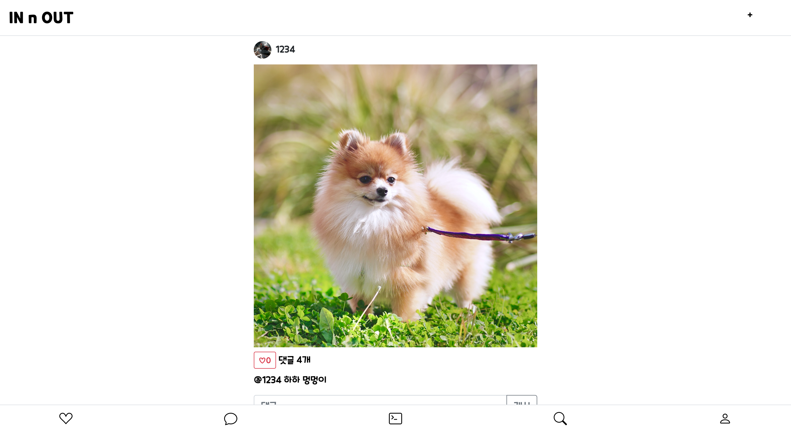</kbd>

> 다양한 디바이스에 대응할 수 있도록 반응형으로 디자인. (SNS와 커뮤니티라는 특성상 모바일 경험을 중심으로 제작)

> 하단 네비게이션 좌측부터 - 친구(팔로잉, 팔로워) / 쪽지 / 뉴스피드 / 커뮤니티(갤러리) / 마이룸(유저페이지)

 

### 로그인 / 회원가입

<kbd>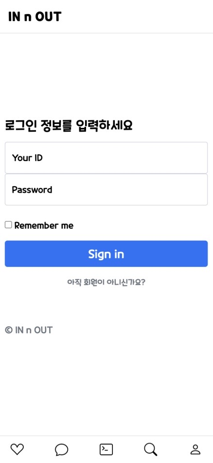</kbd>
<kbd>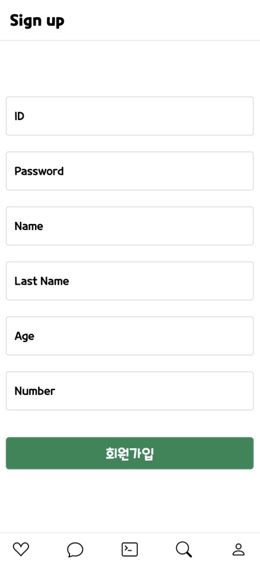</kbd>

> 스프링시큐리티를 이용하여 로그인시 세션 발급, remember me 체크시 쿠키 발급.

 

### 유저룸
<kbd>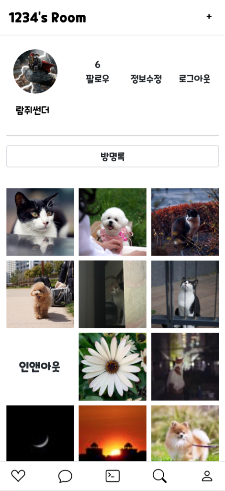</kbd>
<kbd>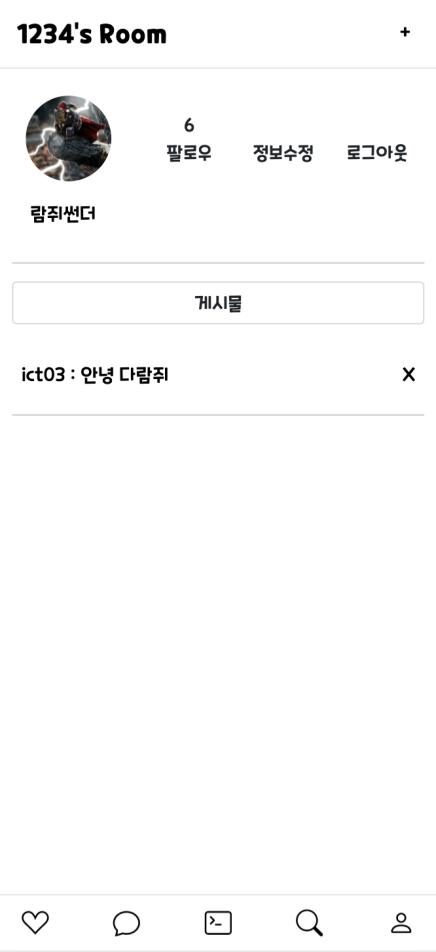</kbd>
<kbd>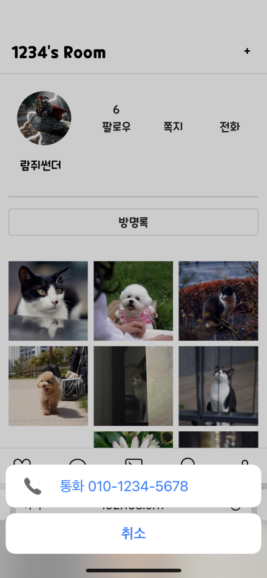</kbd>

> @PathVariable로 유저 아이디를 받아서 해당 유저가 작성한 포스트 썸네일 노출

> @PathVariable 파라미터와 로그인 아이디가 동일할 경우 상단에 정보수정 / 로그아웃 버튼 노출

> @PathVariable 파라미터와 로그인 아이디가 다를 경우 쪽지 / 전화 버튼 노출(모바일 접속 시 전화걸기)

> 팔로우 클릭 시 rest 방식으로 INSERT, 팔로우 숫자 +1

> 이미 팔로우 한 경우 rest 방식으로 DELETE, 팔로우 숫자 -1

> 방명록 / 게시글 버튼을 클릭하여 전환, 서로 팔로우한 경우 방명록 작성 textarea 노출 - rest 방식으로 INSERT

> 로그인 아이디가 @PathVariable이 일치하거나 해당 방명록 작성자인 경우 방명록 삭제 버튼 노출

 

### 친구 (팔로잉, 팔로워)

<kbd>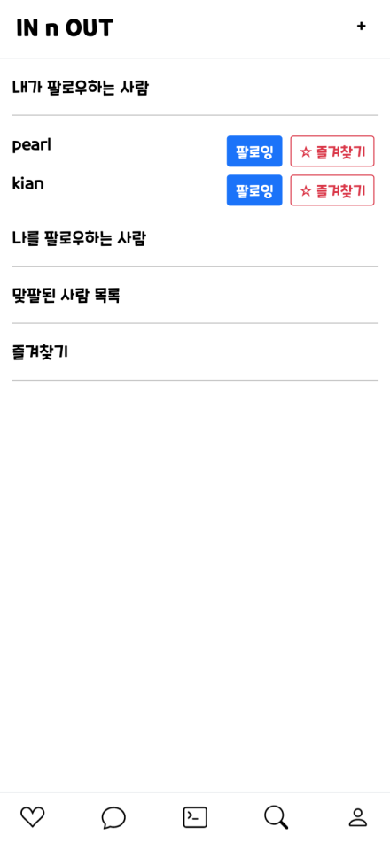</kbd>

> 팔로우 유저 / 팔로잉 유저를 볼 수 있고 버튼 클릭을 통해 rest 방식으로 팔로잉 취소, 즐겨찾기 추가

> 서로 팔로우된 유저끼리는 쪽지기능 활성화, 방명록 기능 활성화

 

### 쪽지

<kbd>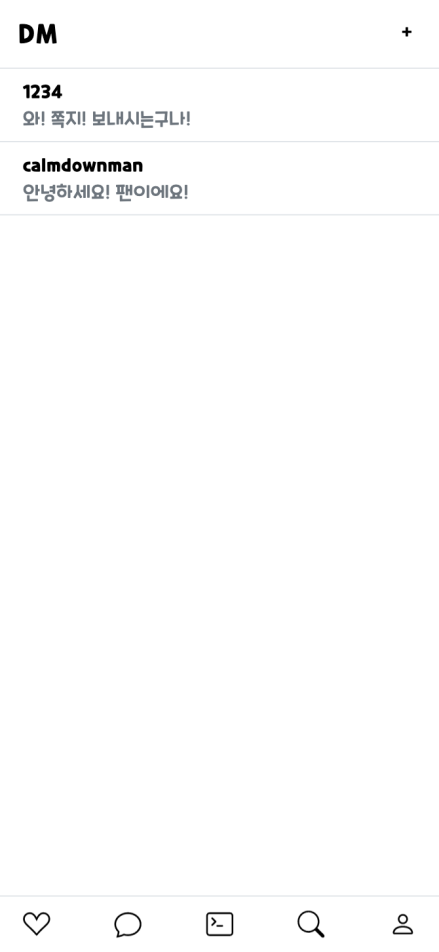</kbd>
<kbd></kbd>

> 로그인 유저와 쪽지를 주고받은 이력이 있는 유저 목록

> 해당 유저와 주고받은 쪽지 중 가장 마지막 쪽지 노출(좌측 이미지) - 클릭시 주고받은 쪽지 전체보기(우측 이미지)

> 주고받은 쪽지 페이징 처리(보낸시간 내림차순 정렬, 하단부터 역순으로 배치)

> 상단 쪽지 더보기 버튼 클릭 시 36개씩 추가 로드

> 하단 input창에 쪽지 내용 입력 후 send 버튼 혹은 엔터키 입력 시 rest 방식으로 INSERT (웹소켓 x / 실시간 x)

 

### 뉴스피드 

<kbd>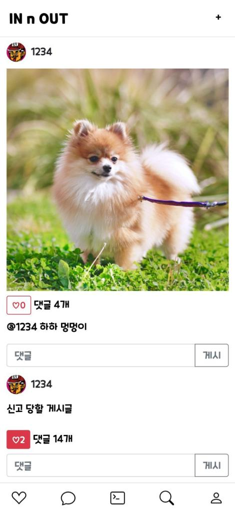</kbd>
<kbd>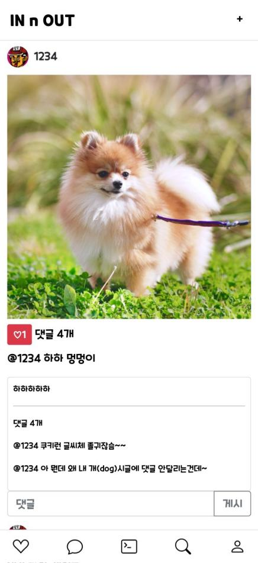</kbd>

> 페이징처리, 인피니티 스크롤을 적용하여 스크롤이 바닥에 닿을 때 마다 rest 방식으로 게시글 12개씩 추가 로드

> 포스트의 경우 기본적으로 제목만 노출(좌측 이미지), 제목 클릭 시 내용과 댓글 노출(우측 이미지) (댓글 노출 기준 : 좋아요 개수 내림차순 정렬 상위 2개)

> 좋아요 클릭 시, 댓글 작성시 rest방식으로 insert. 변경된 내용은 리소스를 줄이기 위해 select 요청을 하는 것이 아닌 자바스크립트를 사용하여 화면상에 추가)

> 댓글 클릭 시 포스트 디테일 페이지로 이동

 

### 뉴스피드 - AD

<kbd>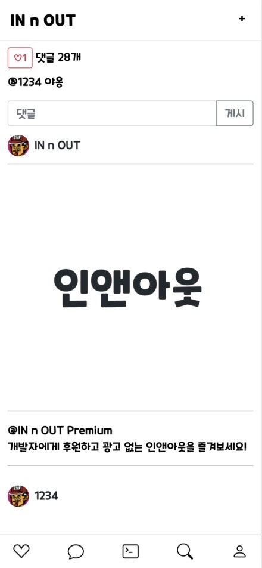</kbd>
<kbd>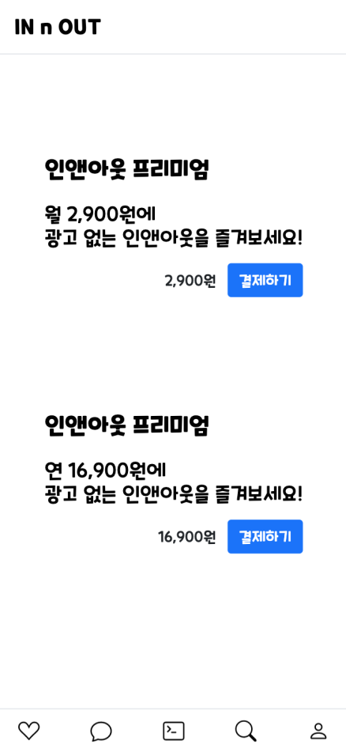</kbd>
<kbd>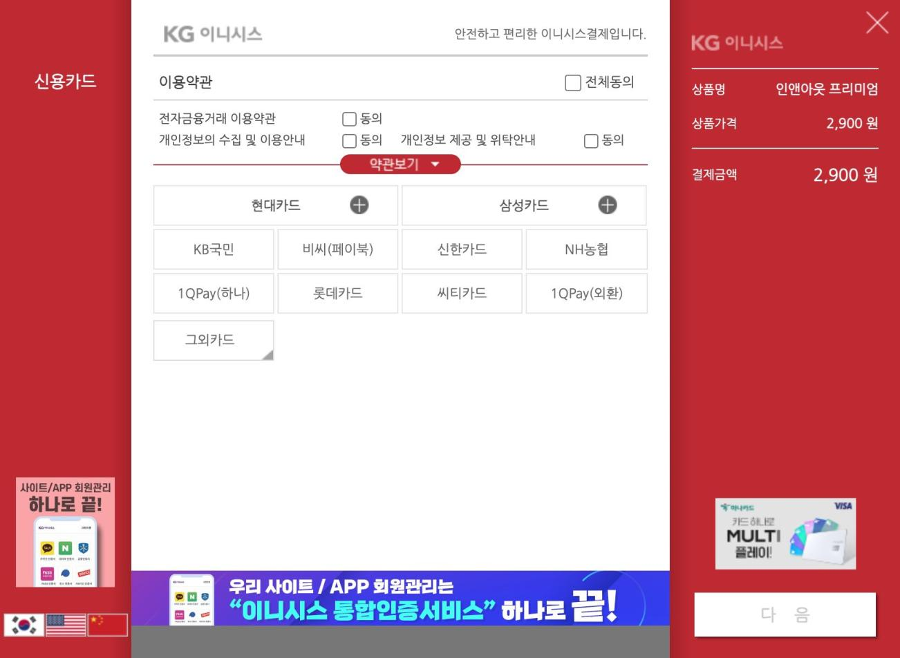</kbd>
<kbd>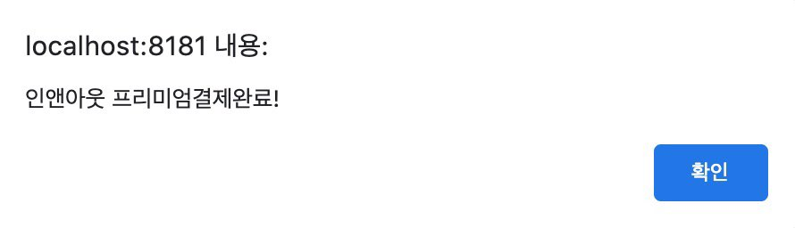</kbd>

> 로그인 아이디가 멤버쉽 권한이 없는 경우 뉴스피드 중간마다 노출, 클릭 시 디테일 페이지로 이동

> 디테일 페이지에서 결제하기 클릭 시 KG이니시스 결제모듈창으로 이동, 결제 시 로그인 계정에 멤버쉽 권한 부여

 

### 포스팅

<kbd></kbd>

> 제목, 내용, 아이디를 파라미터로 받아 포스팅

> 사진 첨부 시 1000*1000 리사이징

> 파일명 중복 방지를 위해 uuid + '파일명'으로 저장

> DB 저장 항목 (포스트 번호, uuid, 파일명, 이미지 경로(날짜별 폴더))

> 해당 날짜 폴더가 존재하지 않는다면 자동으로 생성

### 포스트 - 디테일 페이지

<kbd>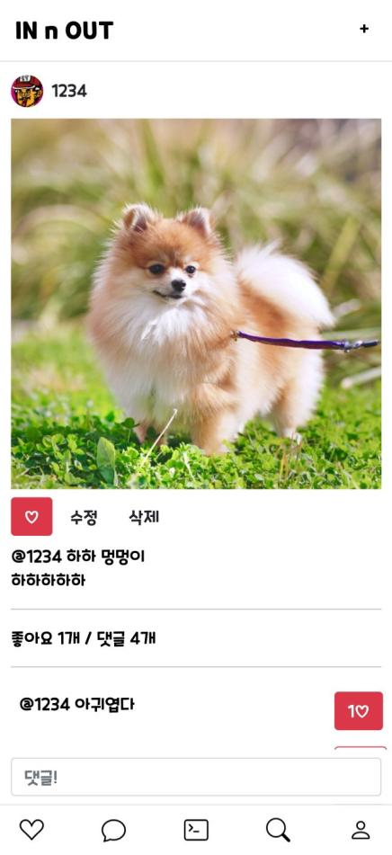</kbd>
<kbd>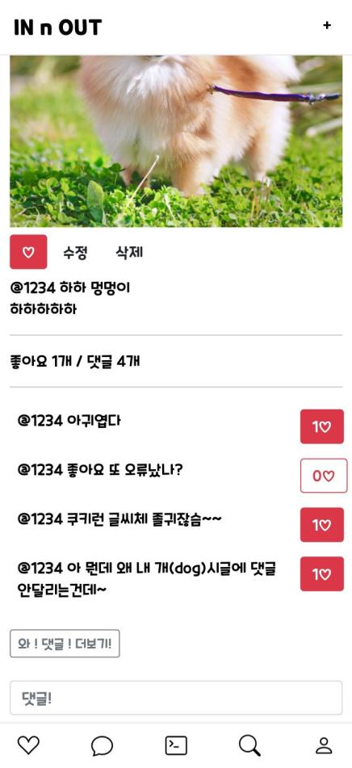</kbd>

> 로그인 아이디와 포스트번호/댓글번호를 파라미터로 넘겨 DB 조회 - 좋아요 누른 내역이 있는 경우 CSS 추가

> 좋아요 버튼 클릭 시 rest 방식으로 로그인 아이디와 해당 포스트 번호를 파라미터로 넘겨 DB 조회. 데이터가 존재하면 DELETE, 데이터가 없다면 INSERT

> <c:if> 태그를 사용해 로그인 아이디와 작성자 아이디가 같을 경우 수정/삭제버튼 노출, 다를 경우 신고버튼 노출

> 터치영역을 고려해 댓글 작성 창 하단에 고정, 엔터키를 감지시 제출

> rest 방식으로 INSERT, 자바스크립트를 사용하여 화면상에 댓글 추가

> 댓글 페이징처리, 하단의 버튼 클릭 시 댓글 12개 추가 로드

 

### 포스트 - 댓글

<kbd>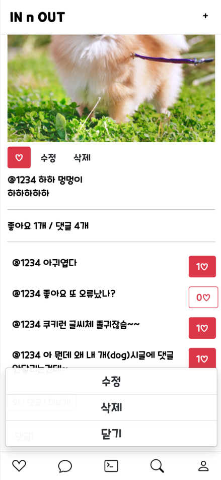</kbd>
<kbd>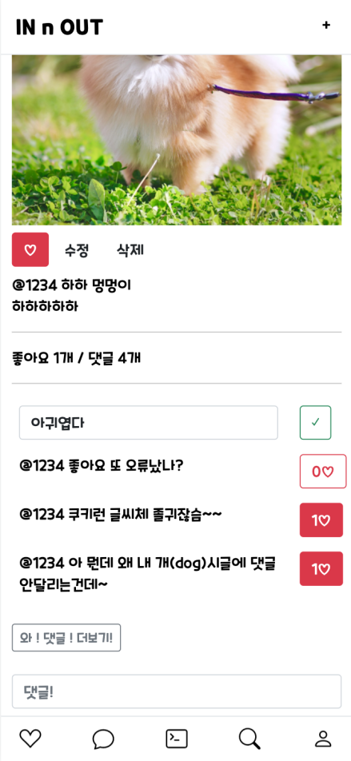</kbd>

> 댓글 클릭 시 모달창 노출 (이벤트 위임, 터치영역 고려 하단 배치)

> <c:if> 태그를 사용해 로그인 아이디와 댓글 작성자 아이디가 같을 경우 수정/삭제버튼 노출, 다를 경우 신고버튼 노출

> 수정버튼 클릭 시 해당 요소를 input 타입으로, 좋아요 버튼을 수정사항 저장 버튼으로 변경

> 수정사항 저장 버튼 클릭 시 해당 내용 rest 방식으로 UPDATE, 화면단 수정된 내용으로 변경

> 삭제버튼 클릭 시 rest 방식으로 DELETE, 화면단에서 해당 요소 삭제

 

### 신고

<kbd>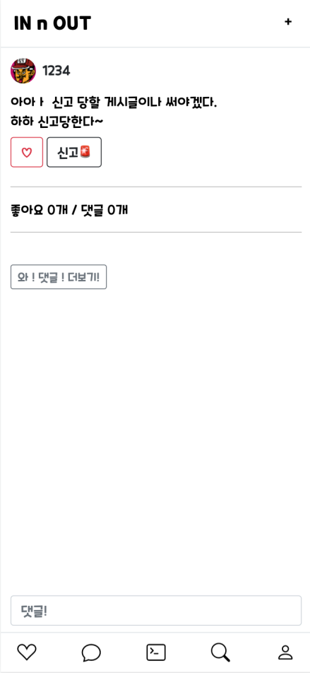</kbd>
<kbd>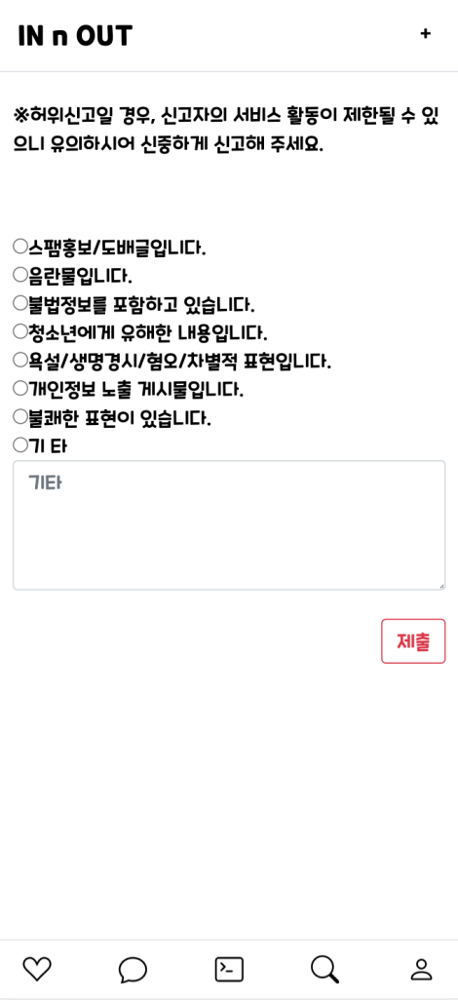</kbd>
<kbd>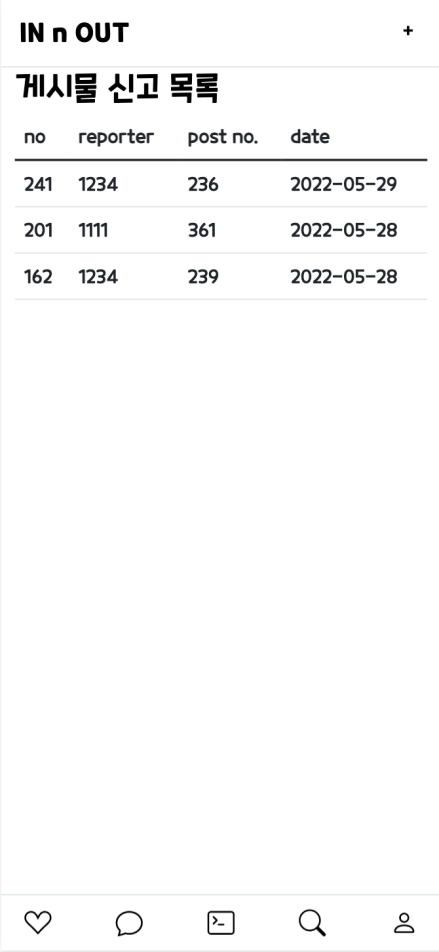</kbd>
<kbd>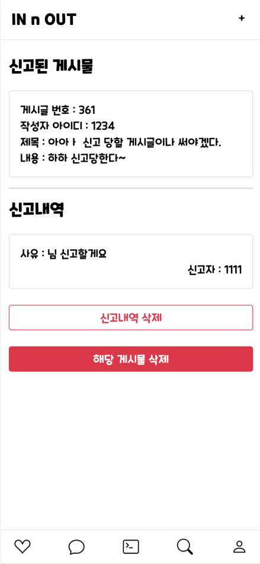</kbd>

> 신고버튼 클릭 시 신고 폼으로 이동

> 신고 사유 선택 가능. 기타 선택 시 직접 입력

> 신고 내역은 admin 계정만 접근 가능한 '신고 목록 페이지'에서 확인 가능. 클릭 시 신고내역 디테일 페이지로 이동

> 디테일 페이지 상단에는 신고된 게시물 노출, 클릭 시 해당 게시글로 이동

> 하단에는 신고 사유와 신고자 아이디 노출. 아이디 클릭시 해당 유저 페이지로 이동

> 허위신고일 경우 '신고내역 삭제' 버튼을 클릭하여 신고 내역 삭제

> 해당 게시글에 문제가 있는 경우 '해당 게시물 삭제' 버튼을 클릭하여 게시물 삭제

 

### 커뮤니티(갤러리)

<kbd>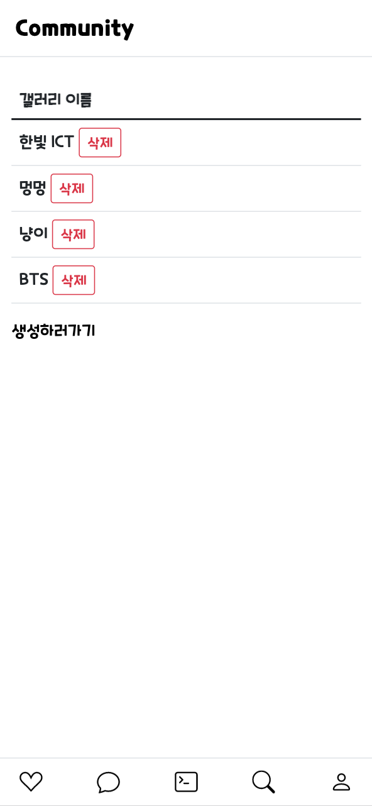</kbd>
<kbd>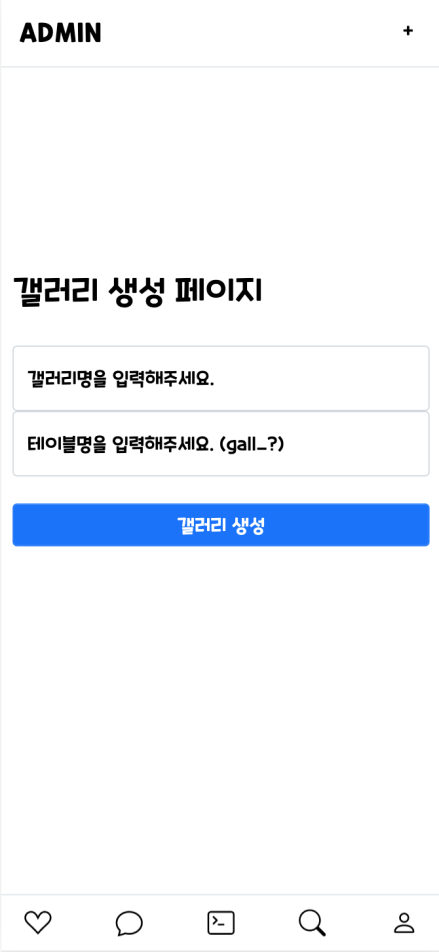</kbd>
<kbd></kbd>
<kbd></kbd>

> 갤러리 리스트(@PathVriable로 갤러리 테이블 구분 / admin 계정의 경우 갤러리 삭제, 생성 버튼 노출)

> 갤러리 생성 폼 - 화면단에 노출될 갤러리명(ex.멍멍), 테이블명(ex. dog) 입력

> MyBatis에 테이블명을 파라미터로 받아 DDL문 실행

> @PathVariable로 구분하여 갤러리 게시글·댓글 DML문 실행

> 각 갤러리마다 웹소켓을 이용한 실시간 채팅 기능 구현
